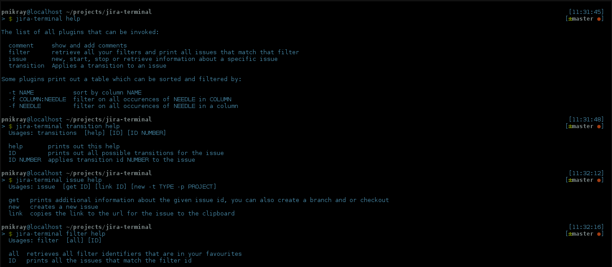
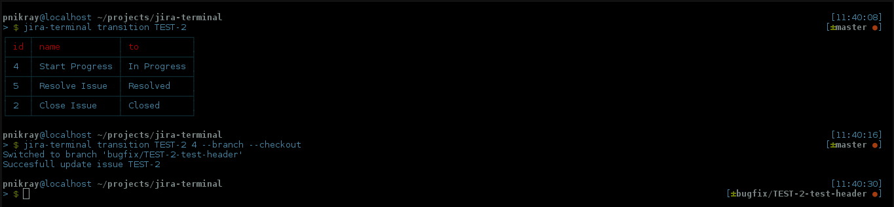

# Jira Terminal 
Let's go away from that ugly GUI of jira and lets just stick to our terminals.  
I  started/created this project to improve my work flow. I was already using git, npm, grunt, bower ... etc. in my terminal, I wanted to use JIRA as well in my terminal.

# Work in progress
 * Search command with jql syntax.
 * Auto complete in terminal.
 * Extend the Filter plugin with showing which issues were edited since it the last time.

# Install
To install: `npm install -g jira-terminal`.  
First time running it will promp you with some information to create a config file.

# How to use it
All the plugins have the `help` commands, IE `jira-terminal issue help`. This also shows what is already implemented.

# Screenshots
Here are some screenshots of the application.

Here is an example of applying a transition and branch & checkout of the issue:

Under [screenshots](screenshots/) you can find more.

# Licence 
MIT
